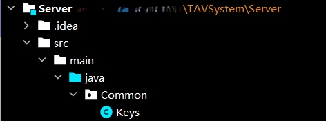
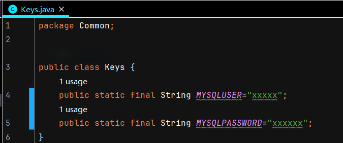

### 计网大作业：IP电话  ———— 带服务端版本

### java socket 编程实现的IP电话：支持text、audio、video
### 开发环境：win10+IDEA+jdk17.0.1 
### exe文件运行所需环境：安装jdk，版本17以上
 

> 由于目前在将Server部署到云服务器时，仍会有udp无法传给client的bug，所以此项目目前只支持局域网下的Server。

#### 不带服务器版本见：
> https://github.com/Seeking-L/TAVNode

#### 运行前修改：
- Server中：由于private key的保密需要，未将Keys类上传。运行前需要添加Keys类，并填写数据库的用户名以及密码。 Keys类如下： 
-   
- 

- Client中： 
    > 由于目前云端服务器尚有bug未修改完成,只能在局域网下本机运行服务器，Server的IP和port无法确定。故：Client在运行前，需要修改Client中保存的Server的IP及port。
    
    在运行Client前： 
  -  首先运行Server，检查Server的打印输出，确定Server是port号。(一般是8888) 
  - 检查Server所在的IP。 
  - 修改Client中的ServerInfo类，修正Server的IP与port。 
   

### 关于打包成exe(Client)：
#### 参考博客
> https://blog.csdn.net/zmq836010/article/details/124257340
#### exe4j配置文件(Client)(请检查文件路径): 
> /exe4jconfig/Client.exe4j
#### exe文件图标:
> /exe4jconfig/OIP-C.jfif